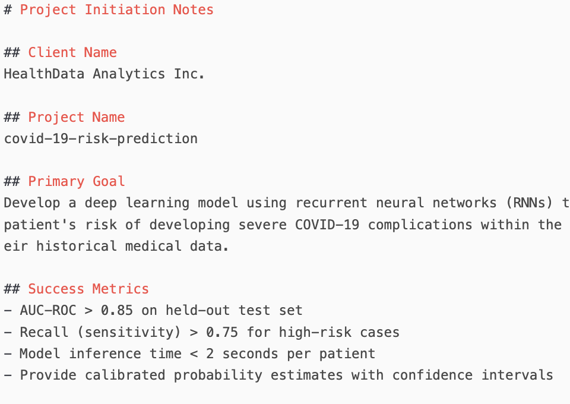

# ML Project Template & Launcher

This repository is the **"Golden Template"** for all new client projects. It is designed to be forked for each new engagement. Its primary function is to standardize the project kickoff process via an automated script (`project_init/cli.py`).

## Purpose
1.  **For Project Lead:** Ensure a consistent and best-practice start for every new project.
2.  **Capture Requirements:** Parse structured meeting notes to capture all critical project information.
3.  **Generate Blueprint:** Produce a `project_manifest.json` and a first-draft AI-generated strategy document (`strategy.md`) to align everyone involved.

---

## For the Project Lead: Per-Project Workflow

This is the process you will follow for **each new client project**.

### Step 1: Create a New Project Repository by Forking
1.  Go to the main [Golden Template](https://github.com/sam0per/ml-project-launch.git) on GitHub.
2.  Click the **"Fork"** button in the top-right corner.
3.  Select your account or organization as the owner. This creates your new project repository under your namespace (e.g., `github.com/LeadUsername/ml-project-launch`).

### Step 2: Get the Code on Your Machine
1.  On your new fork's GitHub page, click the "Code" button and copy the URL.
2.  On your local machine, clone your fork:
    ```bash
    git clone https://github.com/LeadUsername/ml-project-launch.git
    cd ml-project-launch
    ```

### Step 3: Setup the Python Environment
1.  **Create a virtual environment:**
    ```bash
    conda create -n ml-launch python=3.12
    ```
2.  **Activate the environment**
    ```bash
    conda activate ml-launch
    ```
3.  **Install dependencies:**
    ```bash
    pip install -r requirements.txt
    ```
4.  **Install the project in editable mode along with its core dependencies**
    ```bash
    # This command reads setup.py and installs the package, making it importable.
    pip install -e .
    ```
5.  **Configure API Keys:**
    ```bash
    # Copy the example environment file
    cp .env.example .env
    # Now edit .env with your favorite text editor and add your API key
    # (e.g., OPENAI_API_KEY='sk-your-key-here')
    ```

### Step 4: Document Project Requirements
Before running the script, you must document the project's requirements in a structured notes file.

1.  **Create an `inputs` directory** if it doesn't already exist:
    ```bash
    mkdir -p inputs
    ```
2.  **Copy the template** into the `inputs` directory and rename it. It's good practice to include the date.
    ```bash
    cp templates/PROJECT_NOTES_TEMPLATE.md inputs/20250827-awesome-client-notes.md
    ```
3.  **Fill out the new Markdown file** (`inputs/20250827-awesome-client-notes.md`) with the project details.

<figure>
    
    <figcaption>An example of meeting notes</figcaption>
</figure>

### Step 5: Run the Project Initialization Script
Execute the script from the root of the project. It will automatically find the most recent notes file in the `inputs/` directory, parse it, and generate the project manifest.

```bash
python project_init/cli.py
```

Alternatively, you can specify which notes file to use with the `--input` flag:
```bash
python project_init/cli.py --input inputs/20250827-awesome-client-notes.md
```

### Step 6: Review, Commit, and Push
1.  Review the generated files in the `outputs/` directory.
2.  Commit the notes and the generated files to your fork ([Link to conventional commits](https://gist.github.com/qoomon/5dfcdf8eec66a051ecd85625518cfd13)). The script will suggest a branch name like `project/your-project-name`.
    ```bash
    git add inputs/ outputs/
    git commit -m "chore: initialize project with manifest and strategy"
    git push origin project/awesome-client-analysis # Push the new branch the script created
    ```
3.  Finally, give your collaborator access to this fork and branch.

---

## For the Technical Collaborator
Once the Project Lead has completed the steps above and granted you access:
1. Clone the Project Lead's fork (not the original template):
```bash
git clone https://github.com/LeadUsername/ml-project-launch.git
cd ml-project-launch
```
2. Check out the feature branch created for the project:
```bash
git fetch origin
git checkout project/awesome-client-analysis
```
3. The `outputs/` directory contains your blueprint (`manifest.json` and `strategy.md`) for execution. The original notes are in the `inputs/` directory.

---

## Local Development (For Modifying This Template)
If you want to improve this template itself (e.g., add new questions, change the script):
1. Clone the original "Golden Template" repository (this one).
2. Create a new feature branch, make your changes, and submit a Pull Request.
```bash
git clone https://github.com/sam0per/ml-project-launch.git
cd ml-project-launch
git checkout -b feat/add-new-question
# ... make your changes ...
git commit -m "feat: add new question about data privacy"
git push origin feat/add-new-question
# Then open a PR on GitHub from your branch to the main branch.
```

## Structure
```bash
ml-project-launch/
│
├── .github/
│   └── workflows/                 # For GitHub Actions CI/CD (future use)
│
├── docs/                         # For general documentation about *using* this workflow
│   └── WORKFLOW_GUIDE.md
│
├── inputs/                       # For storing project notes files
│   └── .gitkeep                  # Example: my-project-notes.md
│
├── project_init/                 # Main directory for the initialization script
│   ├── __init__.py               # Makes this a Python package
│   ├── cli.py                    # The main script to run (Command-Line Interface)
│   └── notes_parser.py           # Logic for parsing the notes file
│
├── outputs/                      # For script output (e.g., manifest.json)
│   └── .gitkeep
│
├── templates/                    # Directory for any file templates
│   └── PROJECT_NOTES_TEMPLATE.md # The template for project notes
│
├── .env.example                  # Example file for environment variables (e.g., API keys)
├── .gitignore
├── LICENSE
├── README.md                     # Explains the purpose of this template repo
├── requirements.txt              # Python dependencies for the script
└── setup.py                      # Makes the project installable
```
